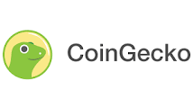

# <h1 align=center> **Cryptocurrency Market Data Analytics** </h1>
# <h1 align=center> **PROYECTO INDIVIDUAL Nº2** </h1>
# <h1 align=center> **PABLO BETI** </h1>

  

## Introducción

¡Bienvenidos a este proyecto de análisis de criptomonedas!, este trabajo se realizó en base al pedido de una empresa de servicios financieros, quien ante el auge del mundo de las criptomonedas está interesada en realizar inversiones.

Por lo que se realizó un estudio exhaustivo sobre el mercado de criptomonedas, dando como resultado el analisis de los principales indicadores de las mismas, los cuales fueron: 

* Capitalizacion de mercado - el precio por el total de circulacion

* Volumen de operaciones

* Tecnologia Subyacente

Atento a la necesidad de realizar una selección de monedas para analizar,procedí a elegir 10 criptomonedas, de las cuales busque las de mayor 'estabilidad', siendo ésta relativa al mundo cripto, tome 5 monedas con la mayor capitalización del mercado al momento de la consulta,siendo esta una medida del tamaño de una criptomoneda, se calcula multiplicando el precio actual por el número total de monedas en circulación. 

Las criptomonedas con un alta **capitalización** de mercado suelen considerarse más estables y menos volátiles que las que tienen una capitalización de mercado más baja. 

Y en base a las oportunidades que presenta este tipo de criptoactivos tome otro criterio para el resto de las monedas a elegir, de las cuales busque las de mayor crecimiento basandome en criptomonedas con una **capitalización de mercado baja** y un **volumen de operaciones** alto. Para lo cual hice un indice de (Volumen de Transacciones /Capitalización de Mercado) para asi elegir las de mayor crecimiento.

Por ultimo **Tecnología** subyacente.

<table>
  <thead>
    <tr>
      <th>Criptomoneda</th>
      <th>Tecnología</th>
      <th>Empresa</th>
      <th>DeFi</th>
      <th>NFTs</th>
      <th>Smart Contracts</th>
    </tr>
  </thead>
  <tbody>
    <tr>
      <td>Bitcoin</td>
      <td>Blockchain</td>
      <td>Ninguna</td>
      <td>No</td>
      <td>No</td>
      <td>Sí</td>
    </tr>
    <tr>
      <td>Ethereum</td>
      <td>Blockchain</td>
      <td>Ninguna</td>
      <td>Sí</td>
      <td>Sí</td>
      <td>Sí</td>
    </tr>
    <tr>
      <td>Tether</td>
      <td>Blockchain</td>
      <td>Tether Limited</td>
      <td>No</td>
      <td>No</td>
      <td>Sí</td>
    </tr>
    <tr>
      <td>Binance Coin</td>
      <td>Blockchain</td>
      <td>Binance</td>
      <td>No</td>
      <td>No</td>
      <td>Sí</td>
    </tr>
    <tr>
      <td>Ripple</td>
      <td>Blockchain</td>
      <td>Ripple</td>
      <td>No</td>
      <td>No</td>
      <td>Sí</td>
    </tr>
    <tr>
      <td>Gala</td>
      <td>Blockchain</td>
      <td>Gala Games</td>
      <td>No</td>
      <td>No</td>
      <td>Sí</td>
    </tr>
    <tr>
      <td>TrueUSD</td>
      <td>Blockchain</td>
      <td>TrustToken</td>
      <td>No</td>
      <td>No</td>
      <td>Sí</td>
    </tr>
    <tr>
      <td>Sui</td>
      <td>Blockchain</td>
      <td>Suiswap</td>
      <td>Sí</td>
      <td>No</td>
      <td>Sí</td>
    </tr>
    <tr>
      <td>Binance USD</td>
      <td>Blockchain</td>
      <td>Paxos</td>
      <td>No</td>
      <td>No</td>
      <td>Sí</td>
    </tr>
    <tr>
      <td>Thorchain</td>
      <td>Blockchain</td>
      <td>Ninguna</td>
      <td>No</td>
      <td>No</td>
      <td>Sí</td>
    </tr>
  </tbody>
</table>

 
 

Es importante considerar la tecnología subyacente de las criptomonedas antes de invertir. Algunas criptomonedas se basan en tecnología más sólida que otras, siendo que la mayoria utiliza la denominada **Blockchain**.

Es importante asegurarse de que la criptomoneda tienen un equipo de desarrollo sólido.

  

## Fuente
Para el presente análisis se utilizo los datos proporcionados por la [API CoinGecko](https://www.coingecko.com/es/api/documentation).

Aun asi en el mundo dinámico de las criptomonedas, la toma de decisiones informadas es crucial. El análisis de las historias individuales de cada criptomoneda revela oportunidades de inversión y estrategias de gestión de riesgos. Esta comprensión profunda no solo identifica proyectos sólidos, sino que también ayuda a enfrentar la volatilidad de manera efectiva.
## KPI's
Al realizar este informe, tome en cuenta una serie de KPI's para analizar y comprender aspectos de las criptomonedas elegidas a traves de : 

* **ROI** - Calcula el porcentaje de ganancia o pérdida en relación con la inversión inicial. Es una medida fundamental para evaluar la rentabilidad de una inversión en criptomonedas. Se calcula mediante la fórmula: ((Valor actual - Valor inicial) / Valor inicial) * 100.

* **MEDIA MOVIL** - La media móvil es un indicador técnico que ayuda a suavizar la variación de precios a lo largo del tiempo, lo que facilita la identificación de tendencias. Puede ser de diferentes tipos (simple, exponencial, ponderada, etc.). En el contexto de las criptomonedas, se utiliza para observar las tendencias a corto y largo plazo en el precio y tomar decisiones basadas en esos movimientos.
 
* **RSI** - El RSI es un indicador técnico que mide la velocidad y cambio de los movimientos de precios en una criptomoneda. Proporciona información sobre si una criptomoneda está sobrecomprada (posible reversión bajista) o sobrevendida (posible reversión alcista). Un RSI por debajo de 30 generalmente indica condiciones de sobreventa, mientras que un RSI por encima de 70 suele indicar sobrecompra.

Estos tres KPIs son herramientas valiosas en el análisis de criptomonedas. El ROI evalúa la rentabilidad general de la inversión, la media móvil ayuda a identificar tendencias y patrones de precios, y el RSI permite detectar posibles oportunidades de inversión basadas en condiciones de sobrecompra o sobreventa. Sin embargo, es esencial recordar que ningún indicador debe considerarse de forma aislada, y siempre se debe combinar con otros análisis y factores para tomar decisiones informadas.

Estos estan reflejados en las visualizaciones realizadas en el Dashboard de este proyecto.

## Análisis Comparativo

Al comparar el rendimiento a lo largo del tiempo de las 10 criptomonedas seleccionadas, se pueden destacar patrones y tendencias interesantes. Algunas criptomonedas han mantenido una estabilidad relativa, mientras que otras han experimentado crecimiento constante o altibajos significativos. Este análisis permite identificar oportunidades y riesgos asociados con cada moneda, ayudando a los inversores a tomar decisiones informadas.

#### Ejemplo de Patrones y Tendencias

Al analizar el rendimiento histórico, hemos observado que Bitcoin y Ethereum tienden a liderar las tendencias alcistas después de correcciones significativas.

## Recomendaciones

Basándonos en los hallazgos obtenidos, se pueden hacer las siguientes recomendaciones a la empresa antes de su toma de decisiones:

1. **Identificar Tendencias Alcistas:** Identificar las criptomonedas con tendencias alcistas puede proporcionar oportunidades de inversión a corto plazo. Analizar los gráficos y las variaciones históricas puede ayudar a anticipar movimientos positivos.

2. **Diversificación de la Cartera:** Se sugiere diversificar la cartera incluyendo criptomonedas con diferentes casos de uso. Esto puede ayudar a mitigar el riesgo al no depender de una sola moneda y aprovechar las oportunidades en diferentes áreas.

3. **Seguimiento Constante:** Dada la volatilidad del mercado de criptomonedas, es crucial realizar un seguimiento constante. Los precios pueden cambiar rápidamente, por lo que mantenerse informado sobre las tendencias actuales es esencial.

## Gestión del Riesgo

La gestión del riesgo es fundamental al invertir en criptomonedas. Se recomienda:

- **Establecer Límites de Inversión:** Definir cuánto estás dispuesto a invertir y nunca superar ese límite. Evitar invertir más de lo que puedes permitirte perder.
  
- **Utilizar Órdenes Stop-Loss:** Establecer órdenes stop-loss puede ayudar a proteger las inversiones. Estas órdenes automatizan la venta de una criptomoneda si su precio cae por debajo de un nivel predeterminado.

- **Investigar y Educar:** Antes de invertir en una criptomoneda, investiga su tecnología, equipo y casos de uso. La educación es clave para tomar decisiones informadas y reducir el riesgo.

# Conclusión

Este proyecto brinda una visión fundamentada para abordar las oportunidades y desafíos del mercado de criptoactivos, al explorar indicadores clave como la capitalización de mercado, el volumen de operaciones y la tecnología subyacente, hemos seleccionado un grupo diverso de criptomonedas con base en su estabilidad y potencial de crecimiento. 

La evaluación detallada de KPIs como el ROI, la media móvil y el RSI ha proporcionado una base sólida para comprender patrones y tendencias a lo largo del tiempo. Las recomendaciones resultantes, centradas en la identificación de tendencias alcistas, la diversificación de la cartera y la gestión del riesgo, subrayan la importancia de la educación continua y la toma de decisiones informadas en un mercado dinámico y en constante evolución. 

Este proyecto no solo ofrece datos y análisis, sino que capacita a los inversores con el conocimiento necesario para navegar con confianza en el  mundo de las criptomonedas y aprovechar su potencial a largo plazo.

## Tecnologias utilizadas:
**Python - Power BI - Pandas - Coingecko** 

<body>
  

    
  

    

    
  

  

    
  

  

    
  

</body>

##
### Gracias por visitar este proyecto.
##

# Datos de Contacto

## Pablo Raul Ricardo Beti
[LINKEDIN](https://www.linkedin.com/in/pablo-beti-714007265/)

[INSTAGRAM](https://www.instagram.com/pablo_beti/)
##